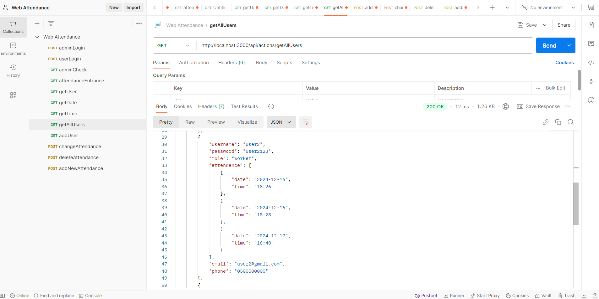

# WebAttendance

__Please click the video below to watch a short demo__

This app is just like a web attendance app that workers use in their work to submit their work hours every day

The app is set to get it's time as Berlin's time, Germany.

The main endpoints to use are:

1. http://localhost:3000/api/admin/login -> This is for admin login. While on Postman the user needs to add JSON file (recommended raw) and put fields of "username" and "password".
2. http://localhost:3000/api/users/login -> This is for user login. While on Postman the user needs to add JSON file (recommended raw) and put fields of "username" and "password".
3. http://localhost:3000/api/attendance/entranceExit -> This is for the user that is logged in to set a new entrance or exit in their attendance.
4. http://localhost:3000/api/actions/getAllUsers -> This is to see all users information, including their attendances.
5. http://localhost:3000/api/actions/loadNewUser -> This is to add a new user to the system. While on Postman you need to implement on JSON file (recommended raw) and put fields of "username", "password", "role", "attendance": [], "email", "phone".
6. http://localhost:3000/api/actions/updateAttendance -> This is to update an existing attendance. on Postman you need to implement on JSON file {recommended raw) and put fields of "username", "oldDate" - format (yyyy-mm-dd), "oldTime" - format (hh:mm), "newDate" - format (yyyy-mm-dd), "newTime" - format (hh:mm).
7. http://localhost:3000/api/actions/deleteAttendance -> This is to delete an existing attendance. on Postman you need to implement on JSON file (recommended raw) and put fields of "username", "oldDate" - format (yyyy-mm-dd), "oldTime" - format (hh:mm).
8. http://localhost:3000/api/actions/addNewAttendance -> This is to add a new attendance that does not exist. in Postman you need to implement JSON file (recommended raw) and put fields of "username", "date" - format (yyyy-mm-dd), "time" - format (hh:mm).

The information is stored on a JSON file on the project.

